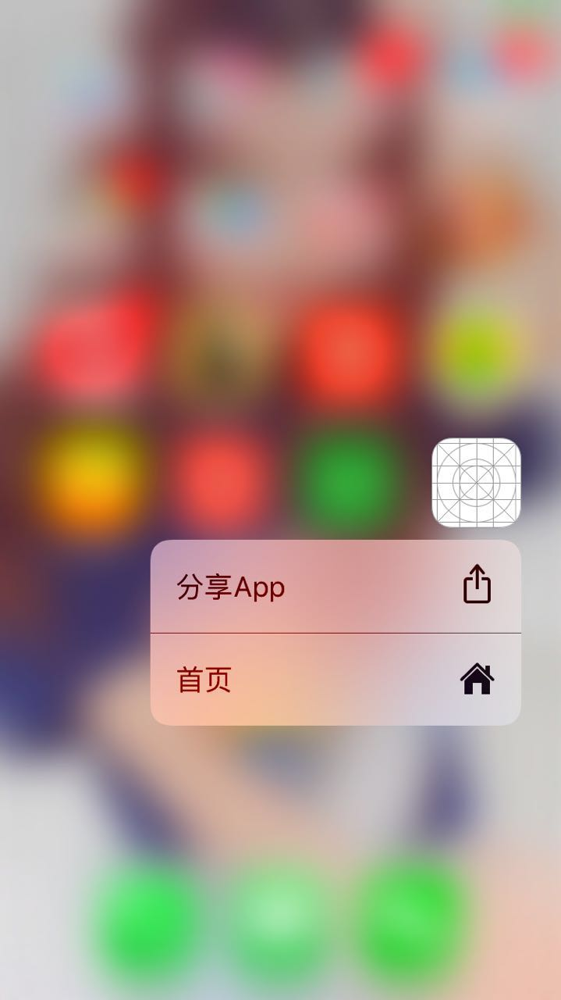

概述
---------------------------------
* 本工程主要是利用iOS 的Objective-C开发的技术要点汇总；
* 涵盖了开发中踩坑的原因，以及填坑的技术分享；
* 抛砖引玉，取长补短，希望能够提供一点思路，避免少走一些弯路。

功能
--------------------------------

- 主要介绍Home Screen Quick Actions,即通过主屏幕的应用Icon，我们可以用3DTouch呼出一个菜单，进行快速定位应用功能模块相关功能的开发。

要求
---------------------------------

* iOS 8+
* Xcode 8.0+

期待
---------------------------------

* 如果在使用过程中遇到BUG，希望你能[Issues](https://github.com/NSLog-YuHaitao/3DTouch/issues)我，谢谢(或者尝试下载最新的代码看看BUG修复没有)。
* 如果在使用过程中发现有更好或更巧妙的实用技术，希望你能[Issues](https://github.com/NSLog-YuHaitao/3DTouch/issues)我，我非常为该项目扩充更多好用的技术，谢谢。
* 如果通过该工程的使用，对您在开发中有一点帮助，码字不易，还请点击右上角star按钮，谢谢。

代码实现
---------------------------------

- AppDelegate.m

~~~
//检测App启动方式
-(void)application:(UIApplication *)application performActionForShortcutItem:(UIApplicationShortcutItem *)shortcutItem completionHandler:(void (^)(BOOL))completionHandler{

    if([shortcutItem.type isEqualToString:@"ONE"]){
        //发送通知
        [[NSNotificationCenter defaultCenter]postNotificationName:@"ONES" object:@"ONES"];

    }else if([shortcutItem.type isEqualToString:@"TWO"]){
        //发送通知
        [[NSNotificationCenter defaultCenter]postNotificationName:@"TWOS" object:@"TWOS"];
    }
}
~~~

- ViewController.m

~~~
//注册通知
- (void)registerNotification{
    [[NSNotificationCenter defaultCenter] addObserver:self selector:@selector(onesNotification) name:@"ONES" object:nil];
    [[NSNotificationCenter defaultCenter] addObserver:self selector:@selector(twpsNotification) name:@"TWOS" object:nil];
}
~~~

~~~
//动态添加标签
NSArray * titleArr = @[@"分享App",@"首页"];
NSArray * typeArr = @[@"ONE",@"TWO"];
NSMutableArray * dataArr = [[NSMutableArray alloc]init];
for (int i = 0; i<titleArr.count; i++) {
    // 创建标签的ICON图标。
    UIApplicationShortcutIcon *icon;
    if (i==0) {
        icon = [UIApplicationShortcutIcon iconWithType:UIApplicationShortcutIconTypeShare];
    }else if(i==1){
        icon = [UIApplicationShortcutIcon iconWithType:UIApplicationShortcutIconTypeHome];
    }
    // 创建一个标签，并配置相关属性。
    UIApplicationShortcutItem *item = [[UIApplicationShortcutItem alloc] initWithType:typeArr[i] localizedTitle:titleArr[i] localizedSubtitle:nil icon:icon userInfo:nil];
    [dataArr addObject:item];
}
// 将标签添加进Application的shortcutItems中。
[UIApplication sharedApplication].shortcutItems = dataArr;
~~~

~~~
//实现通知事件
/**跳转页面一*/
- (void)onesNotification{
    [self.navigationController pushViewController:_oneVC animated:YES];
}
/**跳转页面二*/
- (void)twpsNotification{
    [self.navigationController pushViewController:[twoViewController new] animated:YES];
}
~~~

效果图
-----------------------

    

